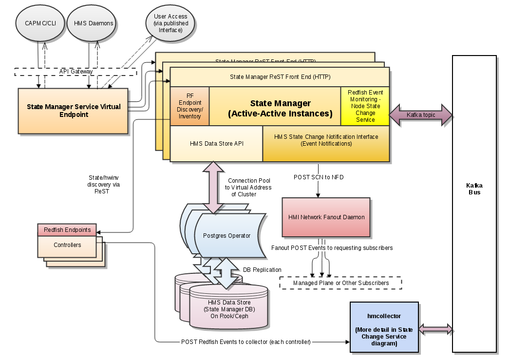
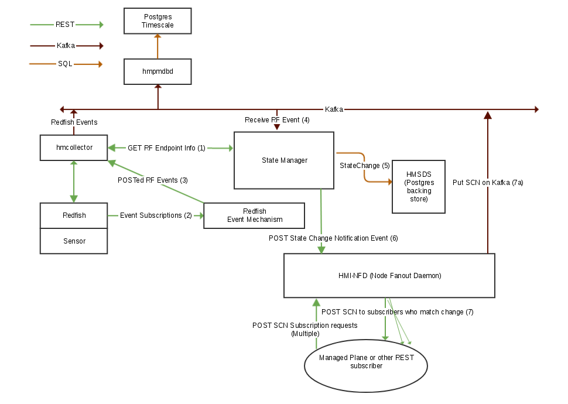

# Cray Hardware State Manager (smd)

__________________________________________________________________

The Shasta Hardware State Manager monitors and interrogates hardware components
in a Shasta system, tracking hardware state and inventory information, and
making it available via REST queries and message bus events when changes occur.

This service provides the following functions:

* Performs inventory discovery of all known Mountain/River controllers in system
  * This process bootstraps everything HSM tracks.
  * Updated in response to component life-cycle changes to keep info current.
  * Interrogates Redfish controllers whenever provided by an endpoint discovery service:
     * REDS
     * MEDS
     * Or manually added to Hardware State Manager via REST
* Tracks hardware state and other high-level component data:
  * Hardware state (e.g. Empty/Off/On/Ready(heart beating))
  * Logical state  (i.e. managed plane software state)
  * Hardware Type  (i.e. Node, Chassis, BMC, Slot), as well as SubType
  * Enabled/Disabled status
  * Role, e.g. Compute vs. NCN type (nodes only)
  * NID, i.e. the numerical Node ID (nodes only)
  * Architecture
* Allows the creation of component groups and partitions
* Tracks default NIDs and Roles to use when discovering new nodes
* Stores Redfish endpoint and component data obtained via inventory discovery
  * Translates global Physical IDs (i.e. xnames) to local Redfish URIs.
  * Stores component-by-component Redfish properties to allow interactions
  * Stores needed boot-time information such as MACs
      * Actions for performing power operations via the managing Redfish EP
      * Service endpoint info, e.g. for performing firmware updates
* Learns, stores and tracks detailed hardware inventory data:
  * Tracks FRU data for manufacturing/service and scheduling (e.g. SLURM)
  * Tracks FRUs by location, showing the present composition of the system.
  * We include the most detailed information available on:
     * The manufacturer, model, revision, and so on describing exactly what is installed.
     * Serial numbers and any other identifying info to track individual pieces of HW
     * Properties of the hardware describing it's resources and abilities, for example: 
         * Speeds
         * Memory/storage capacities
         * Thread and core counts
         * The component family and the specific sub-type in use

## smd Overview 



## smd API

__________________________________________________________________

### API Overview

The main components of _smd_'s RESTful API are as follows:

#### Redfish Endpoints

```text
/hsm/v1/Inventory/RedfishEndpoints

    POST   A new RedfishEndpoint to be inventoried by state manager
    GET    The collection of all RedfishEndpoints, with optional filters.
    
/hsm/v1/Inventory/RedfishEndpoints/{xname-id}
    
    PUT    Updates to a RedfishEndpoint
    GET    The RedfishEndpoint's details or check its discovery status
    DELETE A RedfishEndpoint that is no longer in the system
```

#### Component Redfish endpoint information

```text
/hsm/v1/Inventory/ComponentsEndpoints?filter-option1=xxx...

    GET    Array of Redfish details for a filtered subset of components

/hsm/v1/Inventory/ComponentsEndpoints/{xname-id}

    GET    Redfish details for a specific component
```

#### Component State

```text
/hsm/v1/State/Components?filter-option1=xxx...

    GET    A filtered subset of all components, or a specific component by its id

/hsm/v1/State/Components

    POST   A list of individual component ids to query, and filtering options.

/hsm/v1/State/Components/{xname-id}

    GET    The HW state, flag, role, enabled status, NID, etc. of the component
    PATCH  The HW state, flag, role, enabled status, NID, etc. of a component
```

#### Additional Component State Queries

```text
/hsm/v1/State/Components/Query

    POST   A list of parents and filtering options

/hsm/v1/State/Components/Query/{parent-id}?filter-option1=xxx...

    GET    Parent and children of selected component parent id, optionally filtering
```

#### Hardware Inventory and FRUs

```text
/hsm/v1/Inventory/Hardware/Query/all

    GET    An xthwinv-like json representation of the system's hardware and FRUs.

/hsm/v1/Inventory/HardwareByFRU/{fru-id}

    GET    Details on a particular FRU by it's ID.

/hsm/v1/Inventory/HardwareByFRU/{fru-id}

    GET    Details on a particular FRU by it's ID.
```

#### NodeMaps

```text
/hsm/v1/Defaults/NodeMaps

    GET    All NodeMaps entries, with default NID and Role per xname
    POST   One or more new NodeMaps entries to be added or overwritten

/hsm/v1/Defaults/NodeMaps/{xname}

    GET    The default NID and Role for {xname}
    PUT    Update the default NID and Role for xname {xname}
```

#### Component Groups

```text
/hsm/v1/groups

    GET    Details on all groups
    POST   A new component group with a list of members
    
/hsm/v1/groups/{group-label}

    PATCH  Metadata for an existing group {group-label}
    GET    Details on the group {group-label}, i.e. it's members and metadata

/hsm/v1/groups/{group-label}/members

    GET    Just the member list for a group
    POST   The id of a new component to add to the group's members list
    
/hsm/v1/groups/{group-label}/members/{xname-id}

    DELETE Component {xname-id} from the members of the group {group-label}
```

#### Component Partitions

```text
/hsm/v1/partitions

    GET    Details on all partitions
    POST   A new partition with a list of members
    
/hsm/v1/partitions/{part-name}

    PATCH  Metadata for an existing partition {part-name}
    GET    Details on the partition {part-name}, i.e. it's members and metadata

/hsm/v1/partitions/{part-name}/members

    GET    Just the members list for a partition
    POST   The id of a new component to add to the partition's members list
    
/hsm/v1/partitions/{part-name}/members/{xname-id}

    DELETE Component {xname-id} from the members of partition {part-name}
```

#### Component Group and Partition Memberships

```text
/hsm/v1/memberships?filter-option1=xxx...

    GET    A filtered list of each system component's group/partition memberships

/hsm/v1/memberships/{xname-id}

    GET    The group and partition memberships (if any) of component {xname-id}
```

_NOTE The above is NOT an exhausive list of the API calls and is intended solely as an overview_

### Additional API Documentation

The complete HSM (smd) API documentation is included in the Cray API docs.
This is the nightly-generated version.  Content is generated in an automated
fashion from the current swagger.yaml file.

http://web.us.cray.com/~ekoen/cray-portal/public

Latest detailed API usage examples:

https://github.com/Cray-HPE/hms-smd/blob/master/docs/examples.adoc  (current)

Latest swagger.yaml (if you would prefer to use the OpenAPI viewer of your choice):

https://github.com/Cray-HPE/hms-smd/blob/master/api/swagger_v2.yaml (current)

## SMD CT Testing

This repository builds and publishes hms-smd-ct-test RPMs along with the service itself containing tests that verify SMD on the
NCNs of live Shasta systems. The tests require the hms-ct-test-base RPM to also be installed on the NCNs in order to execute.
The version of the test RPM installed on the NCNs should always match the version of SMD deployed on the system.


## smd Features

__________________________________________________________________

### Feature Map

This is primarily intended to compare XC-Shasta functionality.

| V1 Feature | V1+ Feature | XC Equivalent |
| --- | --- | --- |
| /hsm/v1/State/Components (structure) | - | rs_node_t |
| /hsm/v1/State/Components (GET) | - | xtcli status, but with all fields, including NIDs |
| /hsm/v1/State/Components/Query/<comp> (GET) | - | xtcli status <comp> |
| /hsm/v1/State/Components/<xname>/Enabled (PATCH) | - | xtcli enable/disable <cname> |
| /hsm/v1/State/Components/<xname>/Role (PATCH) | - | xtcli mark <role>(1) |
| /hsm/v1/State/Components/<xname>/StateData (PATCH) | - | xtcli set_empty -f <cname> |
| /hsm/v1/State/Components/<xname>/FlagOnly (PATCH) | - | xtcli set_flag/clr_flag <cname>(2) |
| /hsm/v1/Inventory/Hardware/Query/all (GET) | - | xthwinv s0 |
| /hsm/v1/Inventory/Discover (POST XNames list) | - | xtdiscover --warmswap <xnames>(3) |
| - | Additional Hardware/Query options | xthwinv <other-flags> |
| SCN Events | - | ec_node_(un)available, ec_node_failed |
| - | See Future Features and Updates Below| - |

(1) Role determines Compute vs NCN (Non-Compute Node) type, not Compute vs.
Service as on XC.

(2) Flags cleared automatically on successful state transition, so normally not
needed.

(3) There is no direct equivalent to the full xtdiscover command on Shasta.
Discovery is continuous in response to system events and works in concert with
endpoint discovery performed by MEDS and REDS, as well as system info provided by
(the upcoming) IDEALS.

### Current Features

* Inventory discovery of all known Mountain/River controllers in system
* Tracks hardware state and other high-level component data (like rs_node_t on XC)
* Allows the creation of component groups and partitions
* Tracks default NIDs and Roles to use when discovering new nodes
     * This can be used to distinguish Compute vs Non-Compute Nodes NCNs
* Stores Redfish endpoint and component data obtained via inventory discovery
  * This is used by HMS services such as CAPMC to interact with nodes via Redfish
* Monitors Redfish events from currently supported River/Mountain controller types
     * Looks at BMC alerts/events to track power on/off changes
     * Events vary by manufacturer/firmware version.
* Learns, stores and tracks detailed hardware inventory data.  Currently supported types are:
     * Mountain Chassis and Slots (Compute and Router)
     * Mountain cC and sC and associated board and node subcomponents
     * River BMCs and Nodes for Intel s2600
     * Processors and DIMMs
     * River RackPDUs.
* Sends SCN State Change Notifications via the HMI NFD for Component State and
  other field changes.

### Future Features And Updates

* Automatic warmswaps/removals/additions with no manual rediscovery
* Integration with IDEALS to:
     * Report empty components where missing/undiscovered
     * Retrieve info on manually configured components/endpoints
     * Get information on NID map, roles, etc. from CCD-based data.
     * And so on.
* Performance/scaling optimizations
* Inventory and State monitoring of additional component types
* Support for Gigabyte River nodes (discovery/events)
* Improved FRU tracking
* Historical Location<->FRU tracking
* FRU firmware version tracking
* Full featured push events for all hardware changes for HMS services and
  customer message bus.  (Having services poll HSM doesn't scale.)
* Cease storage of RedfishEndpoint credentials in DB, using vault instead.
* Use HMS specific Kafka bus for Redfish and HSM(smd) events to decouple from
  the telemetry/SMA message bus.
* Improved DB testing capabilities and allowing saving/restoring database
  settings for test/debug
* Dumping state for dump utility(?)


## Design Details

__________________________________________________________________

### States

Note that these are the States HSM directly has access to.  They are basically just the hardware states, with the Ready, et. al states above On being tracked by the heartbeat monitor is the case of nodes (and in the case of controllers, by HSM directly confirming that a component can be accessed for Redfish operations).  Other hardware types will generally go no higher than on.

A separate field, SoftwareStatus, is intended for any additional state that might exist for a heart beating node.   Note that we have no table of these states, nor a transition diagram, because these are a function of the managed plane and we do not limit what can appear there so that there are no dependencies created.
```text
StateUnknown   HMSState = "Unknown"   // The State is unknown.  Appears missing but has not been confirmed as empty.
StateEmpty     HMSState = "Empty"     // The location is not populated with a component
StatePopulated HMSState = "Populated" // Present (not empty), but no further track can or is being done.
StateOff       HMSState = "Off"       // Present but powered off
StateOn        HMSState = "On"        // Powered on.  If no heartbeat mechanism is available, it's software state may be unknown.

StateStandby   HMSState = "Standby" // No longer Ready and presumed dead.  It typically means HB has been lost (w/alert).
StateHalt      HMSState = "Halt"    // No longer Ready and halted.  OS has been gracefully shutdown or panicked (w/ alert).
StateReady     HMSState = "Ready"   // Both On and Ready to provide its expected services, i.e. used for jobs.
```

#### State Transition Rules

To avoid undesirable behavior (bad ordering, invalid states), only certain state transitions are allowed based upon events or REST operations. 

Note that the inventory discovery process has the ability to perform any state change, e.g. when a new component is added or is powered on after appearing to disappear from the system.

Desired new state    -     Required current state
```text
"Unknown":   {}, // Force/HSM-internal only
"Empty":     {}, // Force/HSM-internal only
"Populated": {}, // Force/HSM-internal only
"Off":       {StateOff, StateOn, StateStandby, StateHalt, StateReady},
"On":        {StateOn, StateOff, StateStandby, StateHalt, StateReady},
"Standby":   {StateStandby, StateReady},
"Halt":      {StateHalt, StateReady},
"Ready":     {StateReady, StateOn},
```

### Setting Default Node NIDs and Roles

***Setting default NIDs***

This document describes and provides examples for the Hardware State Manager 
smd) NodeMaps feature, which allows the installer (or a user via the HSM REST
API) to pre-populate default NID assignments for node locations in the system.
These are then used a node with an xname matches the NodeMaps entry of the same
name, setting the correct NID and Role values from the start, and making
it unnecessary to manually patch them.

See: https://connect.us.cray.com/confluence/display/HSOS/HSM+Documentation+for+SPS2+-+Setting+Default+NIDs

### Groups and Partitions

***Groups (or Labels)***

Are named sets of system components, most commonly nodes.   Each component may
belong to any number of groups.  Groups can be created freely, and smd does not
assign them any particular predetermined meaning. 

***Partitions***

Are essentially a kind of group, but have an established meaning and are
treated as distinct entities from groups.  Each component may belong to at most
one partition, and partitions are used as an access control mechanism. 

#### Goals of Group and Partition functionality

1. To allow the creation, deletion and modification of groups and partitions, as well as the members thereof
2. To allow groups and partitions to be used as filtering mechanisms for existing smd API calls.   
       * Filtering by partition should be optimized for use as an access control mechanism.

#### Groups and Partitions Design Document:

See: https://connect.us.cray.com/confluence/display/HSOS/Hardware+State+Manager+Group+and+Partition+Service


### State Change Service - Monitoring Redfish Events

hmcollector polls smd periodically and establishes event subscriptions when
new RedfishEndpoints are found.  These events are used for power state changes
and they are POSTed to a kafka bus (currently the telemetry bus) that smd
then monitors.

When an event comes in, smd establishes the sending BMC and then looks
up (via the ComponentEndpoints) the path of the subcomponent URI referenced in
the payload in order to establish, for example, which of the two nodes under a
node controller is the one powering on or off.

The event payloads used can vary from Redfish implementation to implementation.
In some cases, these are "Alert" type events that are more or less a
repackaging of the underlying iPMI alert message.  In other cases, the
controller may use the standard ResourceEvent registry, where the intent is
to report on Redfish Status field (and other) changes in a more generic way.

***State Change Notification Infrastructure***



## Running smd

__________________________________________________________________

### Run Time Options

Set via -e during docker run or in k8s configuration:

```text
    RF_MSG_HOST - Sets the kafkahost:port:topic
    SMD_PROXY   - socks5 proxy to use when interrogating Redfish endpoint IPs.
    SMD_DBTYPE  - Only option, and default if blank is "postgres"
    SMD_DBNAME  - Name of database to connect to (defaulr: hmsds)
    SMD_DBUSER  - DB Account to use (default: hmsdsuser)
    SMD_DBHOST  - DB Hostname (e.g. cray-smd-postgres in kubernetes)
    SMD_DBPORT  - DB Port (default 5432)
    SMD_DBPASS  - Password for SMD_DBUSER
    SMD_DBOPTS  - Additional DB parameters to append to connection DSN
    LOGLEVEL    - Set log level (0-4)
```

### Development and Testing

#### Running outside of Kubernetes (With Proxy Support)

1. Launch non-clustered postgres container, after making sure postgres is not already running locally on this port
   ```text
   sudo docker run --rm --name cray-smd-postgres -e POSTGRES_PASSWORD=hmsdsuser -e POSTGRES_USER=hmsdsuser -e POSTGRES_DB=hmsds -d -p 5432:5432 postgres:10.8
   ```
2. Launch cray-smd-init container to update or initialize DB schema 
   ```text
   sudo docker pull dtr.dev.cray.com:443/cray/cray-smd-init:latest
   sudo docker run --name smd-init --link cray-smd-postgres:cray-smd-postgres -e SMD_DBHOST=cray-smd-postgres -e SMD_DBOPTS="sslmode=disable" -e SMD_DBPASS=hmsdsuser -d dtr.dev.cray.com:443/cray/cray-smd-init:latest
   ```
3. Launch cray-smd (State Management Daemon a.k.a. HSM) with env variable set to use socks5 proxy (9999 being the example port number):
    ```text
    sudo docker pull dtr.dev.cray.com:443/cray/cray-smd:latest
    sudo docker run --name smd --net host -p 27779:27779 -e SMD_DBHOST=127.0.0.1 -e SMD_DBPASS=hmsdsuser  -e SMD_DBOPTS="sslmode=disable"  -e SMD_PROXY="socks5://127.0.0.1:9999" -d dtr.dev.cray.com:443/cray/cray-smd:latest
    ```
4. Double check everything is working:
    ```text
    bshields@shasta-sms:~> curl -k https://localhost:27779/hsm/v1/groups
    []
    ```

#### Using Proxy Mode to Get Access to Non-Local BMCs

Find the machine you wish to discover and ssh to it with dynamic port
forwarding enabled on the local port you gave for SMD_PROXY:

```bash
ssh -D 9999 root@example-sms.us.cray.com
```

Leave this window open until you are finished with the discovery.

Double check /etc/hosts for the BMC IP addresses that are assigned to the nodes
you wish to discover, in case they are non-standard ones

#### Discovering Nodes Once HSM is Properly Running

If the proxy has been set up (or you are running locally on an SMS), then
you can then create endpoints for every BMC you wish to discover using their
native BMC IP addresses.

_NOTE: If you need particular NIDs and Roles, you will need to set up xname_
_entries in /hsm/v1/Defaults/NodeMaps BEFORE discovery OR patch the NID and/or_
_Role fields after discovery:_

See: https://connect.us.cray.com/confluence/display/HSOS/HSM+Documentation+for+SPS2+-+Setting+Default+NIDs

***Example creation and discovery of preview system computes***

These are the usual computes found on a standard preview system, but you can easily adapt this example for whatever is in /etc/hosts.  Just make sure you use the BMC xname and a raw IP (if using a socks5 proxy):

```text
curl -k -d '{"ID": "x0c0s28b0", "RediscoverOnUpdate":true, "Hostname":"10.4.0.5", "User": "root","Password": "somePassword"}' -H "Content-Type: application/json" -X POST https://localhost:27779/hsm/v1/Inventory/RedfishEndpoints
curl -k -d '{"ID": "x0c0s26b0", "RediscoverOnUpdate":true, "Hostname":"10.4.0.6", "User": "root","Password": "somePassword"}' -H "Content-Type: application/json" -X POST https://localhost:27779/hsm/v1/Inventory/RedfishEndpoints
curl -k -d '{"ID": "x0c0s24b0", "RediscoverOnUpdate":true, "Hostname":"10.4.0.7", "User": "root","Password": "somePassword"}' -H "Content-Type: application/json" -X POST https://localhost:27779/hsm/v1/Inventory/RedfishEndpoints
curl -k -d '{"ID": "x0c0s21b0", "RediscoverOnUpdate":true, "Hostname":"10.4.0.8", "User": "root","Password": "somePassword"}' -H "Content-Type: application/json" -X POST https://localhost:27779/hsm/v1/Inventory/RedfishEndpoints
```

NOTE: the above path is assuming you are running docker in a bare container (see above).  Otherwise use 'https://<standard-api-gateway-host>/apis/smd/hsm/v1/... instead of 'https://localhost:27779/hsm/...'

Also note that inventory discovery is a read-only operation and should not do anything to the endpoints besides walk them via GETs.   The "RediscoverOnUpdate":true field is important because it will automatically kick off inventory discovery.

#### Running on Craystack or Other Node-Less Machine

Running a plain docker container is not really practical in a full helm-based
deployment because of the lack of integration and features that are provided
via helm.

The easiest way to add nodes via discovery is to find nodes that have
externally visible IP addresses for their BMCs.

I've not gotten the socks5 method above to work in kubernetes, but it might
be something simple.  Logging into each cray-smd pod using kubectl exec 
and doing "apk add openssh" will allow you to install ssh and use it to
connect to external hosts, however the -D option gives an error logging in.
In any case, you would have to reroll the values.yaml helm chart for
cray-hms-smd (and incrememnt the version number in Chart.yaml) to add the
SMD_PROXY env variable (see above)

***Accessing Postgres Operator***

You can access the postgres database cluster as follows:

```text
sms-1:~ # kubectl get pods -n services | grep smd
sms-1:~ # kubectl exec -it -n services cray-smd-{id-from-previous} -- /bin/sh

/ # cat /secrets/postgres/hmsdsuser/password   # Copy to clipboard
/ # psql hmsds hmsdsuser -h cray-smd-postgres-0 -W 
(Paste password)
```

At this point, you have two options.

1. Use the following instructions to dump (from a real machine) a db backup and restore it on craystack if the db is fresh and empty.
```text
https://www.postgresql.org/docs/11/backup-dump.html
```
2. Use the instructions below to manually create a few Components (limited functonality) via the pgsl client directly.

#### Manually Adding State/Component Entries

WARNING:  This only works for some kinds of testing as it creates incomplete configurations (but should work with group, partition, and State/Components calls, though remember that normally there will be non-Node components you will need to filter out if that's desired).

Moreover, even in this case, adding entries manually can create a corrupt database even if data is correct but improperly normalized.  Best to not stray from the example below except to change the slot number in the xname and the NID.  

1. Access the database on one of the postgres containers, as described above, from the cray-smd pod:
```text
(cray-smd-container) # psql hmsds hmsdsuser -h cray-smd-postgres-0 -W
<enter password from /secrets/postgres/hmsdsuser/password, see above>
```
2. Create Nodes one at a time with the following template (follow carefully, note '123' is the NID).
```text
hmsds=> insert INTO components (id,type,state,flag,enabled,admin,role,nid,subtype,nettype,arch) VALUES('x0c0s0b0n0','Node','Empty','OK',true,'','Compute',123,'','Sling','X86');
```
3. If you get the following, the insert worked and you are on the primary node for the postgres cluster.
```text
INSERT 0 1  # <- SUCCESS, running on primary
```
4. If you get the following error, repeat steps 1 and 2 with -h cray-smd-postgres-1 and, if needed, -h cray-smd-postgres-2.  Password is the same.
```text
ERROR:  cannot execute INSERT in a read-only transaction   # <- Not on primary postgres pod
```

##### Additional psql commands to help with adjusting the contents of the HSM database

* Quitting the psql editor

```text
hmsds=> \q
```

* Display contents of a  table

```text
hmsds=> SELECT * FROM table_name;
```

* Display contents of the components table

```text
hmsds=> SELECT * FROM components;
```

* Display only components of type 'Node' from the components table

```text
hmsds=> SELECT * FROM components
hmsds-> WHERE type = 'Node';
```

* Delete a node from the components table; Necessary precursor to re-adding the same node with different values

```text
hmsds=> DELETE FROM components                                                                                                                                                                                                                                                WHERE id = 'x3000c0s19b1n0';
```

* Create a node in the components table with the given attributes

```text
hmsds=> insert INTO components (id,type,state,flag,enabled,admin,role,nid,subtype,nettype,arch) VALUES('x0c0s0b0n0','Node','Empty','OK',true,'','Compute',123,'','Sling','X86');
```

* List available tables

```text
hmsds=> \dt
```

* Describe a table

```text
hmsds=> \d table_name
```

* Command history

```text
hmsds=> \s
```

* Get help on psql commands

```text
hmsds=> \h
```

#### Loading a Database Backup from a Real System:

I don't have step-by-step instructions but the basic idea is to:

1. At some point use the above instructions to access postgres on a real system and run pg_dump.
2. On Craystack, access postgres on the primary node after smd is first installed and load the dump

For more info: https://www.postgresql.org/docs/11/backup-dump.html

Note if it is easier, you can run pg_dump/psql on the sms, but you must use 
the IP, not the hostname, of the cray-smd-postgres-[012] service.  Running
kubectl get services -n services will get you this IP.
